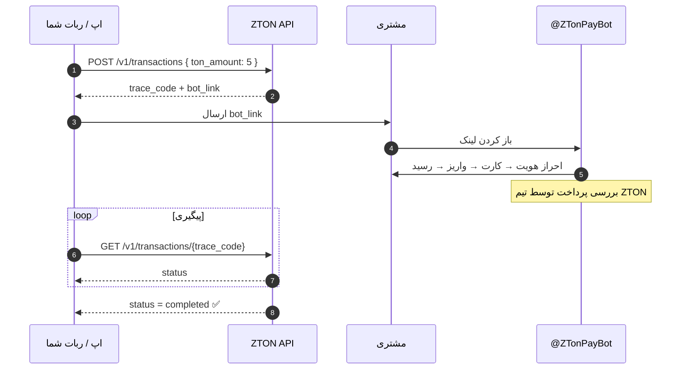
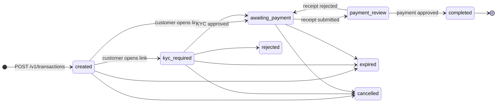

<div align="center">


# API پرداخت ZTON

**ربات، فروشگاه یا اپلیکیشن خودتان را به ZTON وصل کنید و با یک درخواست HTTP لینک خرید TON با ریال بسازید.**

[](https://t.me/ZTonPayBot)
[](#-مرجع-api)
[](https://ton.org)

[English](README.md) · **فارسی**

</div>

> [!TIP]
> **Looking for English?** Read the main guide here: **[📖 English documentation →](README.md)**

<div dir="rtl">

---

## 📚 فهرست

- [روند کار](#-روند-کار)
- [دریافت کلید API](#-دریافت-کلید-api)
- [شروع سریع](#-شروع-سریع)
- [مرجع API](#-مرجع-api)
  - [احراز هویت](#احراز-هویت)
  - [استعلام قیمت](#۱-استعلام-قیمت)
  - [ساخت لینک پرداخت](#۲-ساخت-لینک-پرداخت)
  - [پیگیری تراکنش](#۳-پیگیری-تراکنش)
- [چرخهٔ عمر تراکنش](#-چرخهٔ-عمر-تراکنش)
- [خطاها](#-خطاها)
- [نمونه کد](#-نمونه-کد)
- [توصیه‌ها](#-توصیهها)
- [پشتیبانی](#-پشتیبانی)

---

## ✨ روند کار

شما سفارش را با API می‌سازید و مشتری داخل تلگرام پرداخت می‌کند. احراز هویت (KYC)، انتخاب کارت بانکی، واریز و ارسال رسید همه داخل ربات انجام می‌شود و لازم نیست هیچ‌کدام را خودتان پیاده‌سازی کنید.

</div>



<div dir="rtl">

**TON کجا واریز می‌شود؟** وقتی سفارش تکمیل شود، TON به **کیف پول داخل ربات شما** (همکار صاحب کلید API) واریز می‌شود و هر وقت بخواهید می‌توانید از ربات برداشتش کنید.

---

## 🔑 دریافت کلید API

**کلید API** و **آدرس API** را از ربات تلگرام **[@ZTonPayBot](https://t.me/ZTonPayBot)** می‌گیرید.

1. ربات **[@ZTonPayBot](https://t.me/ZTonPayBot)** را باز کنید و **Start** را بزنید.
2. به بخش **🤝 همکاران** بروید، **ثبت فروشگاه** را بزنید و اطلاعات فروشگاهتان را بفرستید.
3. صبر کنید تا تیم ZTON فروشگاه شما را تأیید کند.
4. وارد **🔑 کلیدهای API** شوید، **ساخت کلید API** را بزنید و یک برچسب وارد کنید (مثلاً `prod-server`).
5. ربات **کلید API** و **آدرس API** شما را می‌فرستد. هر دو را جای امنی نگه دارید.

</div>

> [!IMPORTANT]
> کلید کامل **فقط یک بار** نمایش داده می‌شود. اگر گمش کردید، آن را در ربات لغو کنید و کلید جدید بسازید.
> هر همکار در هر زمان فقط **یک کلید فعال** می‌تواند داشته باشد.

> [!WARNING]
> فقط **همکاران تأییدشده و فعال** می‌توانند از کلید API استفاده کنند. اگر همکاری شما لغو شود یا خودتان از آن خارج شوید، کلید بلافاصله از کار می‌افتد و خطای `403 forbidden` برمی‌گرداند.

<div dir="rtl">

---

## 🚀 شروع سریع

دو متغیر محیطی را با همان مقدارهایی که ربات داده تنظیم کنید:

</div>

```bash
export ZTON_API="https://<your-api-base-url>"   # آدرسی که @ZTonPayBot نشان می‌دهد
export ZTON_KEY="<your-api-key>"
```

<div dir="rtl">

**۱. قیمت ۵ TON را ببینید**

</div>

```bash
curl -s "$ZTON_API/v1/quote?ton_amount=5" \
  -H "Authorization: Bearer $ZTON_KEY"
```

<div dir="rtl">

**۲. لینک پرداخت بسازید**

</div>

```bash
curl -s -X POST "$ZTON_API/v1/transactions" \
  -H "Authorization: Bearer $ZTON_KEY" \
  -H "Content-Type: application/json" \
  -d '{"ton_amount": 5}'
```

<div dir="rtl">

**۳. `bot_link` را برای مشتری بفرستید و وضعیت را پیگیری کنید**

</div>

```bash
curl -s "$ZTON_API/v1/transactions/TRABCD1234" \
  -H "Authorization: Bearer $ZTON_KEY"
```

<div dir="rtl">

کل اتصال همین است. 🎉

---

## 📖 مرجع API

| | |
|---|---|
| **آدرس پایه** | موقع ساخت یا مشاهدهٔ کلید در [@ZTonPayBot](https://t.me/ZTonPayBot) نمایش داده می‌شود |
| **فرمت** | JSON روی HTTPS |
| **احراز هویت** | `Authorization: Bearer <API_KEY>` |
| **مستندات تعاملی** | Swagger UI در `{BASE_URL}/docs` (اگر ربات لینک مستندات را نشان دهد) |
| **بررسی سلامت** | `GET /health` ← `{"status": "ok"}` (بدون نیاز به کلید) |

### واحدها

| مقدار | واحد | توضیح |
|---|---|---|
| `*_nano` | نانو-TON | `۱ TON = ۱٬۰۰۰٬۰۰۰٬۰۰۰ نانو`. برای TON بر `10^9` تقسیم کنید |
| `irr_*` / `*_irr` | ریال | همیشه **ریال** است، نه تومان (`۱۰ ریال = ۱ تومان`) |
| زمان‌ها | ISO 8601 به وقت UTC | مثلاً `2026-05-17T16:00:00Z` |

</div>

> [!NOTE]
> فیلدهای اعشاری مثل `profit_margin_percent` و `rate_irr_per_ton` در پاسخ استعلام قیمت، به‌صورت **رشتهٔ JSON** برمی‌گردند (مثلاً `"2.50"`) تا دقتشان از بین نرود. آن‌ها را با نوع decimal بخوانید، نه float.

<div dir="rtl">

### احراز هویت

همهٔ درخواست‌های `/v1` باید کلید را در هدر `Authorization` داشته باشند:

</div>

```http
Authorization: Bearer YOUR_API_KEY
```

<div dir="rtl">

| حالت | پاسخ |
|---|---|
| هدر ارسال نشده | `401 unauthorized` |
| کلید ناشناخته، لغوشده یا منقضی | `404 not_found` |
| کلید معتبر است اما همکاری فعال نیست | `403 forbidden` |

---

### ۱. استعلام قیمت

</div>

```http
GET /v1/quote
```

<div dir="rtl">

قیمت فعلی TON و مبلغ دقیق پرداخت را برمی‌گرداند. **دقیقاً یکی** از این دو پارامتر را بفرستید:

| پارامتر | نوع | توضیح |
|---|---|---|
| `ton_amount` | اعشاری | مقدار TON برای خرید، مثلاً `5` یا `0.5` |
| `irr_amount` | عدد صحیح | مبلغ ریالی برای خرج کردن، مثلاً `50000000` |

</div>

<details>
<summary dir="rtl"><b>مثال‌ها</b></summary>

```http
GET /v1/quote?ton_amount=5
Authorization: Bearer YOUR_API_KEY
```

```http
GET /v1/quote?irr_amount=10000000
Authorization: Bearer YOUR_API_KEY
```

</details>

<div dir="rtl">

**پاسخ** `200 OK`

</div>

```json
{
  "ton_amount_nano": 5000000000,
  "irr_amount": 12500000,
  "rate_irr_per_ton": "2400000",
  "profit_margin_percent": "2.50",
  "network_fee_nano": 0,
  "service_fee_irr": 300000,
  "quote_expires_at": "2026-05-17T16:10:00Z",
  "rate_source": "nobitex",
  "rate_fetched_at": "2026-05-17T16:00:00Z"
}
```

<div dir="rtl">

| فیلد | توضیح |
|---|---|
| `ton_amount_nano` | مقدار TON به نانو-TON |
| `irr_amount` | مبلغ کل ریالی قابل پرداخت (با کارمزد) |
| `rate_irr_per_ton` | نرخ بازار برای این استعلام، قبل از اعمال سود |
| `profit_margin_percent` | درصد سود سرویس روی نرخ بازار |
| `network_fee_nano` | کارمزد شبکه به نانو-TON |
| `service_fee_irr` | سهم سود از `irr_amount` |
| `quote_expires_at` | زمانی که این قیمت دیگر معتبر نیست |
| `rate_source` | منبع قیمت: `nobitex` (اصلی) یا `tabdeal` (پشتیبان) |
| `rate_fetched_at` | زمان دریافت نرخ بازار |

</div>

> [!NOTE]
> استعلام قیمت چیزی رزرو نمی‌کند و فقط قیمت را نشان می‌دهد. سفارش‌ها حداقل و حداکثر مبلغ دارند. اگر خارج از این بازه باشید، خطای `422 validation_error` می‌گیرید و متن خطا حد مجاز را می‌گوید.

<div dir="rtl">

---

### ۲. ساخت لینک پرداخت

</div>

```http
POST /v1/transactions
Content-Type: application/json
Authorization: Bearer YOUR_API_KEY
```

<div dir="rtl">

یک سفارش خرید TON می‌سازد و **`bot_link`** برمی‌گرداند. این لینک را برای مشتری بفرستید تا در تلگرام بازش کند و پرداخت را همان‌جا انجام دهد.

**بدنهٔ درخواست**

</div>

```json
{
  "ton_amount": 5
}
```

<div dir="rtl">

| فیلد | نوع | الزامی | توضیح |
|---|---|---|---|
| `ton_amount` | اعشاری | یکی از این دو | مقدار TON برای خرید |
| `irr_amount` | عدد صحیح | یکی از این دو | مبلغ ریالی برای خرج کردن |

</div>

> [!CAUTION]
> از `ton_amount` و `irr_amount` **فقط یکی** را بفرستید. فرستادن هر دو یا هیچ‌کدام خطای `422` می‌دهد. فیلدهای ناشناخته هم رد می‌شوند.

<div dir="rtl">

**پاسخ** `201 Created`

</div>

```json
{
  "trace_code": "TRABCD1234",
  "bot_link": "https://t.me/ZTonPayBot?start=TRABCD1234",
  "status": "created",
  "ton_amount_nano": 5000000000,
  "irr_amount": 12500000,
  "expires_at": "2026-05-17T17:00:00Z",
  "created_at": "2026-05-17T16:00:00Z"
}
```

<div dir="rtl">

| فیلد | توضیح |
|---|---|
| `trace_code` | شناسهٔ یکتای سفارش (`TR` و ۸ نویسه). برای پیگیری از آن استفاده کنید |
| `bot_link` | لینک تلگرامی که مشتری برای پرداخت باز می‌کند |
| `status` | اینجا همیشه `created` است و بعد از باز شدن لینک تغییر می‌کند |
| `ton_amount_nano` | مقدار TON قفل‌شده برای این سفارش |
| `irr_amount` | مبلغ ریالی که مشتری باید بپردازد |
| `expires_at` | مشتری باید تا این زمان پرداخت را تمام کند |
| `created_at` | زمان ساخت سفارش |

<details>
<summary><b>مسیرهای قدیمی</b> (هنوز پذیرفته می‌شوند، اما توصیه نمی‌شوند)</summary>

این مسیرها همان کار را انجام می‌دهند تا اتصال‌های قدیمی از کار نیفتند:

| ساخت | پیگیری |
|---|---|
| `POST /v1/traces` | `GET /v1/traces/{trace_code}` |
| `POST /v1/transaction` | `GET /v1/transaction/{trace_code}` |
| `POST /v1/transactions/create` | |
| `POST /v1/transaction/create` | |
| `POST /v1/traces/create` | |

</details>

---

### ۳. پیگیری تراکنش

</div>

```http
GET /v1/transactions/{trace_code}
Authorization: Bearer YOUR_API_KEY
```

<div dir="rtl">

فقط سفارش‌هایی را می‌توانید ببینید که با حساب **خودتان** ساخته شده‌اند.

**پاسخ** `200 OK`

</div>

```json
{
  "trace_code": "TRABCD1234",
  "status": "awaiting_payment",
  "effective_status": "kyc_required",
  "blocked_reason": "kyc_required",
  "ton_amount_nano": 5000000000,
  "irr_amount": 12500000,
  "rate_irr_per_ton": 2400000,
  "profit_margin_percent": "2.50",
  "network_fee_nano": 0,
  "service_fee_irr": 300000,
  "quote_expires_at": "2026-05-17T16:10:00Z",
  "expires_at": "2026-05-17T17:00:00Z",
  "completed_at": null,
  "created_at": "2026-05-17T16:00:00Z",
  "irr_card_last4": null,
  "deposit_wallet_address": "EQC...",
  "user_card_last4": null,
  "bot_link": "https://t.me/ZTonPayBot?start=TRABCD1234"
}
```

<div dir="rtl">

| فیلد | توضیح |
|---|---|
| `status` | وضعیت ذخیره‌شدهٔ سفارش ([چرخهٔ عمر](#-چرخهٔ-عمر-تراکنش) را ببینید) |
| `effective_status` | **وضعیت واقعی همین لحظه.** برای نمایش به کاربر از این استفاده کنید |
| `blocked_reason` | دلیل متوقف شدن مشتری، یا `null` (پایین را ببینید) |
| `completed_at` | زمان واریز TON، یا `null` |
| `irr_card_last4` | ۴ رقم آخر کارتی که مشتری به آن واریز می‌کند |
| `user_card_last4` | ۴ رقم آخر کارت خود مشتری |
| `deposit_wallet_address` | کیف پول ZTON اختصاص‌یافته به این سفارش |
| `bot_link` | همان لینک پرداخت. می‌توانید دوباره برای مشتری بفرستید |

**مقدارهای `blocked_reason`**

| مقدار | معنی |
|---|---|
| `kyc_required` | مشتری باید احراز هویت را در ربات تمام کند |
| `card_required` | مشتری باید کارت بانکی اضافه و تأیید کند |
| `card_selection_required` | مشتری باید کارت پرداخت را انتخاب کند |
| `null` | مانعی وجود ندارد |

</div>

> [!TIP]
> به مشتری `effective_status` و `blocked_reason` را نشان دهید، نه `status` را. مثلاً اگر `blocked_reason: "kyc_required"` گرفتید، کنار `bot_link` بنویسید «لطفاً احراز هویت را در ربات کامل کنید».

<div dir="rtl">

---

## 🔄 چرخهٔ عمر تراکنش

</div>



<div dir="rtl">

| وضعیت | معنی | نهایی؟ |
|---|---|:---:|
| `created` | سفارش ساخته شده و مشتری هنوز لینک را باز نکرده | |
| `kyc_required` | مشتری باید در ربات احراز هویت کند | |
| `awaiting_payment` | مشتری باید واریز کند و رسید بفرستد | |
| `payment_review` | رسید ارسال شده و تیم ZTON در حال بررسی است | |
| `completed` | ✅ پرداخت تأیید شد و TON به کیف پول داخل ربات شما واریز شد | ✔️ |
| `rejected` | ❌ سفارش رد شد | ✔️ |
| `expired` | ⌛ سفارش قبل از پرداخت منقضی شد | ✔️ |
| `cancelled` | 🚫 سفارش لغو شد | ✔️ |

مسیر معمول: `created` ← `awaiting_payment` ← `payment_review` ← `completed`

</div>

> [!NOTE]
> وقتی مشتری رسید را ارسال کند، سفارش تا زمان بررسی در وضعیت `payment_review` می‌ماند، حتی اگر `expires_at` گذشته باشد.
> اگر رسید رد شود، سفارش به `awaiting_payment` برمی‌گردد و مشتری می‌تواند رسید جدید بفرستد.

<div dir="rtl">

---

## 🚨 خطاها

همهٔ خطاها یک شکل دارند. متن `message` فارسی است و می‌توانید همان را به کاربر نشان دهید.

</div>

```json
{
  "error": "validation_error",
  "message": "فقط یکی از مقدار TON یا مبلغ ریالی باید وارد شود",
  "details": {}
}
```

<div dir="rtl">

| HTTP | `error` | چه زمانی |
|:---:|---|---|
| `400` | `domain_error` | خطای عمومی درخواست |
| `401` | `unauthorized` | هدر `Authorization` ارسال نشده |
| `403` | `forbidden` | همکاری فعال نیست یا حساب غیرفعال شده |
| `404` | `not_found` | کلید ناشناخته، لغوشده یا منقضی؛ یا `trace_code` وجود ندارد یا مال شما نیست |
| `405` | `method_not_allowed` | متد HTTP برای این مسیر اشتباه است |
| `409` | `conflict` | حساب یا سفارش در وضعیتی است که این کار را اجازه نمی‌دهد |
| `422` | `validation_error` | ورودی نامعتبر: هر دو مبلغ یا هیچ‌کدام، کمتر از حداقل یا بیشتر از حداکثر، فیلد ناشناخته |
| `503` | `price_provider_unavailable` | قیمت لحظه‌ای TON فعلاً در دسترس نیست. بعداً دوباره تلاش کنید |
| `503` | `ton_liquidity_insufficient` | موجودی TON فعلاً کافی نیست. بعداً دوباره تلاش کنید |
| `503` | `service_unavailable` | خطای موقت سرویس. بعداً دوباره تلاش کنید |

در خطاهای `422` که به ساختار درخواست مربوط‌اند، `details.errors` فیلدهای نامعتبر را فهرست می‌کند.

---

## 💻 نمونه کد

</div>

<details open>
<summary dir="rtl"><b>🐍 Python</b> (<code>httpx</code>)</summary>

```python
import os
import httpx

API = os.environ["ZTON_API"]
client = httpx.Client(
    base_url=API,
    headers={"Authorization": f"Bearer {os.environ['ZTON_KEY']}"},
    timeout=15,
)

# ۱) ساخت لینک پرداخت برای ۵ TON
resp = client.post("/v1/transactions", json={"ton_amount": 5})
resp.raise_for_status()
order = resp.json()
print("این لینک را برای مشتری بفرستید:", order["bot_link"])

# ۲) پیگیری وضعیت
tx = client.get(f"/v1/transactions/{order['trace_code']}").json()
print(tx["effective_status"], tx["blocked_reason"])
```

</details>

<details>
<summary dir="rtl"><b>🟨 JavaScript / Node.js</b> (<code>fetch</code>)</summary>

```js
const API = process.env.ZTON_API;
const headers = {
  Authorization: `Bearer ${process.env.ZTON_KEY}`,
  "Content-Type": "application/json",
};

// ۱) ساخت لینک پرداخت برای ۱۰ میلیون ریال
const res = await fetch(`${API}/v1/transactions`, {
  method: "POST",
  headers,
  body: JSON.stringify({ irr_amount: 10_000_000 }),
});
const order = await res.json();
if (!res.ok) throw new Error(`${order.error}: ${order.message}`);
console.log("این لینک را برای مشتری بفرستید:", order.bot_link);

// ۲) پیگیری وضعیت
const tx = await (
  await fetch(`${API}/v1/transactions/${order.trace_code}`, { headers })
).json();
console.log(tx.effective_status, tx.blocked_reason);
```

</details>

<details>
<summary dir="rtl"><b>🐘 PHP</b> (<code>cURL</code>)</summary>

```php
<?php
$api = getenv('ZTON_API');
$key = getenv('ZTON_KEY');

$ch = curl_init("$api/v1/transactions");
curl_setopt_array($ch, [
    CURLOPT_POST           => true,
    CURLOPT_RETURNTRANSFER => true,
    CURLOPT_HTTPHEADER     => [
        "Authorization: Bearer $key",
        'Content-Type: application/json',
    ],
    CURLOPT_POSTFIELDS     => json_encode(['ton_amount' => 5]),
]);
$order = json_decode(curl_exec($ch), true);
curl_close($ch);

echo "Send this to your customer: " . $order['bot_link'] . PHP_EOL;
```

</details>

<details>
<summary dir="rtl"><b>⏱️ پیگیری تا رسیدن به وضعیت نهایی</b> (Python)</summary>

```python
import time

FINAL = {"completed", "rejected", "expired", "cancelled"}

def wait_for(trace_code: str, every: int = 15) -> dict:
    while True:
        tx = client.get(f"/v1/transactions/{trace_code}").json()
        if tx["status"] in FINAL:
            return tx
        time.sleep(every)

result = wait_for(order["trace_code"])
print("وضعیت نهایی:", result["status"])
```

</details>

<div dir="rtl">

---

## ✅ توصیه‌ها

- 🔒 **کلید را فقط روی سرور نگه دارید.** هیچ‌وقت آن را در اپ موبایل، فرانت‌اند وب یا ریپوی عمومی قرار ندهید.
- 🔁 **کلید لو رفت؟** همان لحظه در ربات لغوش کنید و کلید جدید بسازید.
- 🧾 **`trace_code` هر سفارش را ذخیره کنید.** تنها شناسه‌ای است که لازم دارید.
- ⏱️ **با فاصلهٔ معقول پیگیری کنید**، مثلاً هر ۱۰ تا ۳۰ ثانیه، و وقتی سفارش به وضعیت نهایی رسید متوقف شوید.
- 🧮 **با عدد صحیح نانو-TON و ریال کار کنید.** برای مبالغ مالی از float استفاده نکنید.
- 🌐 **از آدرس پایه‌ای که ربات می‌دهد استفاده کنید** و آدرس دیگری را در کد ثابت نکنید.
- ♻️ **در خطای `503` با فاصلهٔ افزایشی دوباره تلاش کنید.** این خطاها موقت‌اند.

---

## 💬 پشتیبانی

سؤال، درخواست همکاری یا مشکلی دارید؟ از طریق **[@ZTonPayBot](https://t.me/ZTonPayBot)** با ما در ارتباط باشید.

</div>

<div align="center">

<br>


<sub>ساخته‌شده با 💙 توسط <b>ZTON Community</b></sub>

</div>
