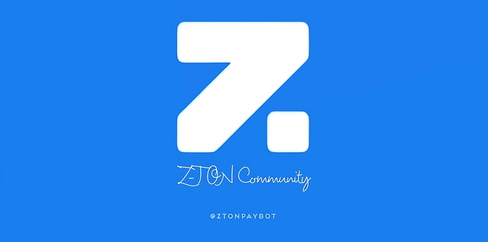
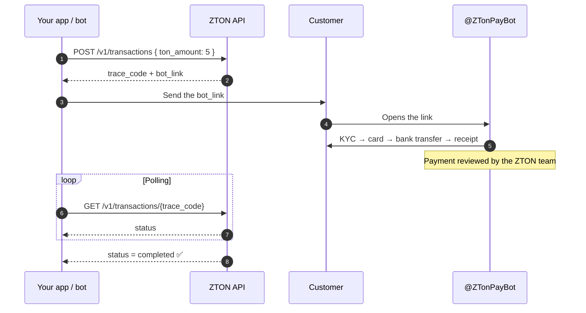
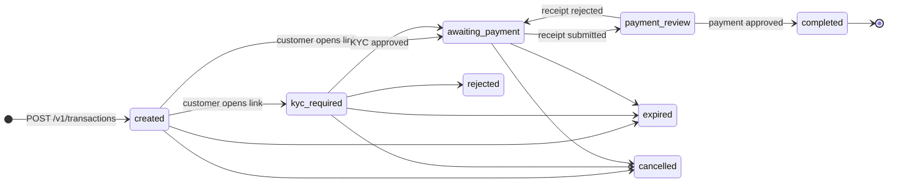

<div align="center">



# ZTON Pay API

**Let your bot, shop or app sell TON for Iranian Rial (IRR): one HTTP request returns a payment link.**

[](https://t.me/ZTonPayBot)
[](#-api-reference)
[](https://ton.org)

**English** · [فارسی](README.fa.md)

</div>

> [!TIP]
> **فارسی‌زبان هستید؟** نسخهٔ فارسی این راهنما را اینجا بخوانید: **[📖 راهنمای فارسی ←](README.fa.md)**

---

## 📚 Contents

- [How it works](#-how-it-works)
- [Get your API key](#-get-your-api-key)
- [Quick start](#-quick-start)
- [API reference](#-api-reference)
  - [Authentication](#authentication)
  - [`GET /v1/quote`: price quote](#1-get-a-price-quote)
  - [`POST /v1/transactions`: create a payment link](#2-create-a-payment-link)
  - [`GET /v1/transactions/{trace_code}`: check status](#3-check-a-transaction)
- [Transaction lifecycle](#-transaction-lifecycle)
- [Errors](#-errors)
- [Code examples](#-code-examples)
- [Best practices](#-best-practices)
- [Support](#-support)

---

## ✨ How it works

You create the order over the API. Your customer pays inside Telegram. The bot takes care of identity checks (KYC), choosing a bank card, the bank transfer and the payment receipt, so you don't have to build any of it.



**Where the TON goes:** when an order is completed, the TON is credited to **your in-bot ZTON wallet** (the partner who owns the API key). You can withdraw it from the bot whenever you like.

---

## 🔑 Get your API key

Your **API key** and your **API base URL** both come from the Telegram bot **[@ZTonPayBot](https://t.me/ZTonPayBot)**.

1. Open **[@ZTonPayBot](https://t.me/ZTonPayBot)** and press **Start**.
2. Go to **🤝 همکاران** (Partners) → **ثبت فروشگاه** (Register shop) and send your shop details.
3. Wait until the ZTON team approves your shop.
4. Open **🔑 کلیدهای API** (API keys) → **ساخت کلید API** (Create API key) and type a label, for example `prod-server`.
5. The bot replies with your **API key** and your **API base URL**. Save both somewhere safe.

> [!IMPORTANT]
> The full API key is shown **only once**. If you lose it, revoke it in the bot and create a new one.
> Each partner can have **one active key** at a time.

> [!WARNING]
> Only **approved, active partners** can use API keys. If your partnership is revoked or you leave it, your key stops working right away and returns `403 forbidden`.

---

## 🚀 Quick start

Set two environment variables. Use the exact values the bot gave you:

```bash
export ZTON_API="https://<your-api-base-url>"   # shown by @ZTonPayBot
export ZTON_KEY="<your-api-key>"
```

**1. Check the price of 5 TON**

```bash
curl -s "$ZTON_API/v1/quote?ton_amount=5" \
  -H "Authorization: Bearer $ZTON_KEY"
```

**2. Create a payment link**

```bash
curl -s -X POST "$ZTON_API/v1/transactions" \
  -H "Authorization: Bearer $ZTON_KEY" \
  -H "Content-Type: application/json" \
  -d '{"ton_amount": 5}'
```

**3. Send `bot_link` to your customer, then check the status**

```bash
curl -s "$ZTON_API/v1/transactions/TRABCD1234" \
  -H "Authorization: Bearer $ZTON_KEY"
```

That's the whole integration. 🎉

---

## 📖 API reference

| | |
|---|---|
| **Base URL** | Shown by [@ZTonPayBot](https://t.me/ZTonPayBot) when you create or view your key |
| **Format** | JSON over HTTPS |
| **Auth** | `Authorization: Bearer <API_KEY>` |
| **Interactive docs** | Swagger UI at `{BASE_URL}/docs`, when the bot shows a docs link |
| **Health check** | `GET /health` → `{"status": "ok"}` (no auth needed) |

### Units

| Value | Unit | Note |
|---|---|---|
| `*_nano` | nano-TON | `1 TON = 1,000,000,000 nano`. Divide by `10^9` to get TON. |
| `irr_*` / `*_irr` | Rial (IRR) | Always **Rial**, never Toman. `10 Rial = 1 Toman`. |
| Timestamps | ISO 8601, UTC | For example `2026-05-17T16:00:00Z` |

> [!NOTE]
> Decimal fields such as `profit_margin_percent`, and `rate_irr_per_ton` in the quote response, are returned as **JSON strings** (for example `"2.50"`) so no precision is lost. Parse them with a decimal type, not a float.

### Authentication

Every `/v1` request needs your key in the `Authorization` header:

```http
Authorization: Bearer YOUR_API_KEY
```

| Situation | Response |
|---|---|
| Header missing | `401 unauthorized` |
| Key unknown, revoked or expired | `404 not_found` |
| Key is valid, but the partnership is not active | `403 forbidden` |

---

### 1. Get a price quote

```http
GET /v1/quote
```

Returns the current TON price and the exact amount you would pay. Send **exactly one** of these query parameters:

| Parameter | Type | Description |
|---|---|---|
| `ton_amount` | decimal | How much TON to buy, for example `5` or `0.5` |
| `irr_amount` | integer | How many Rials to spend, for example `50000000` |

<details>
<summary><b>Examples</b></summary>

```http
GET /v1/quote?ton_amount=5
Authorization: Bearer YOUR_API_KEY
```

```http
GET /v1/quote?irr_amount=10000000
Authorization: Bearer YOUR_API_KEY
```

</details>

**Response** `200 OK`

```json
{
  "ton_amount_nano": 5000000000,
  "irr_amount": 12500000,
  "rate_irr_per_ton": "2400000",
  "profit_margin_percent": "2.50",
  "network_fee_nano": 0,
  "service_fee_irr": 300000,
  "quote_expires_at": "2026-05-17T16:10:00Z",
  "rate_source": "nobitex",
  "rate_fetched_at": "2026-05-17T16:00:00Z"
}
```

| Field | Description |
|---|---|
| `ton_amount_nano` | TON amount, in nano-TON |
| `irr_amount` | Total Rials to pay, service fee included |
| `rate_irr_per_ton` | Market rate used for this quote, before the margin |
| `profit_margin_percent` | Service margin applied on top of the market rate |
| `network_fee_nano` | Network fee, in nano-TON |
| `service_fee_irr` | The margin part of `irr_amount` |
| `quote_expires_at` | Time after which this price is no longer valid |
| `rate_source` | Price source: `nobitex` (primary) or `tabdeal` (fallback) |
| `rate_fetched_at` | When the market rate was fetched |

> [!NOTE]
> A quote doesn't reserve anything. It only shows the price. Orders have a minimum and maximum amount. If you go outside them, the request fails with `422 validation_error`, and the message tells you the limit.

---

### 2. Create a payment link

```http
POST /v1/transactions
Content-Type: application/json
Authorization: Bearer YOUR_API_KEY
```

Creates a buy-TON order and returns a **`bot_link`**. Send this link to your customer. They open it in Telegram and finish the payment there.

**Request body**

```json
{
  "ton_amount": 5
}
```

| Field | Type | Required | Description |
|---|---|---|---|
| `ton_amount` | decimal | one of the two | How much TON to buy |
| `irr_amount` | integer | one of the two | How many Rials to spend |

> [!CAUTION]
> Send **only one** of `ton_amount` and `irr_amount`. Sending both, or neither, returns `422`. Unknown fields are also rejected.

**Response** `201 Created`

```json
{
  "trace_code": "TRABCD1234",
  "bot_link": "https://t.me/ZTonPayBot?start=TRABCD1234",
  "status": "created",
  "ton_amount_nano": 5000000000,
  "irr_amount": 12500000,
  "expires_at": "2026-05-17T17:00:00Z",
  "created_at": "2026-05-17T16:00:00Z"
}
```

| Field | Description |
|---|---|
| `trace_code` | Unique order ID (`TR` + 8 characters). Use it to check the status later |
| `bot_link` | The Telegram link your customer opens to pay |
| `status` | Always `created` here. It changes after the customer opens the link |
| `ton_amount_nano` | TON amount locked for this order |
| `irr_amount` | Rials the customer has to pay |
| `expires_at` | The customer must finish paying before this time |
| `created_at` | When the order was created |

<details>
<summary><b>Legacy routes</b> (still accepted, not recommended)</summary>

These aliases do the same thing, so older integrations keep working:

| Create | Get |
|---|---|
| `POST /v1/traces` | `GET /v1/traces/{trace_code}` |
| `POST /v1/transaction` | `GET /v1/transaction/{trace_code}` |
| `POST /v1/transactions/create` | |
| `POST /v1/transaction/create` | |
| `POST /v1/traces/create` | |

</details>

---

### 3. Check a transaction

```http
GET /v1/transactions/{trace_code}
Authorization: Bearer YOUR_API_KEY
```

You can only read orders created by **your** account.

**Response** `200 OK`

```json
{
  "trace_code": "TRABCD1234",
  "status": "awaiting_payment",
  "effective_status": "kyc_required",
  "blocked_reason": "kyc_required",
  "ton_amount_nano": 5000000000,
  "irr_amount": 12500000,
  "rate_irr_per_ton": 2400000,
  "profit_margin_percent": "2.50",
  "network_fee_nano": 0,
  "service_fee_irr": 300000,
  "quote_expires_at": "2026-05-17T16:10:00Z",
  "expires_at": "2026-05-17T17:00:00Z",
  "completed_at": null,
  "created_at": "2026-05-17T16:00:00Z",
  "irr_card_last4": null,
  "deposit_wallet_address": "EQC...",
  "user_card_last4": null,
  "bot_link": "https://t.me/ZTonPayBot?start=TRABCD1234"
}
```

| Field | Description |
|---|---|
| `status` | Status stored for the order (see the [lifecycle](#-transaction-lifecycle)) |
| `effective_status` | **What is really happening right now.** Use this for your UI |
| `blocked_reason` | Why the customer is stuck, or `null`. See below |
| `completed_at` | When the TON was credited, or `null` |
| `irr_card_last4` | Last 4 digits of the card the customer pays into |
| `user_card_last4` | Last 4 digits of the customer's own card |
| `deposit_wallet_address` | ZTON wallet assigned to this order |
| `bot_link` | Same payment link. You can send it to the customer again |

**`blocked_reason` values**

| Value | Meaning |
|---|---|
| `kyc_required` | The customer has to finish identity verification in the bot |
| `card_required` | The customer has to add and verify a bank card |
| `card_selection_required` | The customer has to pick which card to pay with |
| `null` | Nothing is blocking the order |

> [!TIP]
> Show your customer `effective_status` and `blocked_reason`, not `status`. For example, if you get `blocked_reason: "kyc_required"`, show "Please complete verification in the bot" next to the `bot_link`.

---

## 🔄 Transaction lifecycle



| Status | Meaning | Final? |
|---|---|:---:|
| `created` | Order created. The customer hasn't opened the link yet | |
| `kyc_required` | The customer has to verify their identity in the bot | |
| `awaiting_payment` | The customer has to make the bank transfer and send the receipt | |
| `payment_review` | Receipt submitted. The ZTON team is reviewing it | |
| `completed` | ✅ Payment approved and TON credited to your in-bot wallet | ✔️ |
| `rejected` | ❌ Order rejected | ✔️ |
| `expired` | ⌛ The order expired before payment | ✔️ |
| `cancelled` | 🚫 The order was cancelled | ✔️ |

The usual path is `created` → `awaiting_payment` → `payment_review` → `completed`.

> [!NOTE]
> Once the customer submits a receipt, the order stays in `payment_review` until it's reviewed, even if `expires_at` has passed.
> If a receipt is rejected, the order goes back to `awaiting_payment` and the customer can send a new one.

---

## 🚨 Errors

Every error has the same shape. The `message` is in Persian, so you can show it to your users as is.

```json
{
  "error": "validation_error",
  "message": "فقط یکی از مقدار TON یا مبلغ ریالی باید وارد شود",
  "details": {}
}
```

| HTTP | `error` | When |
|:---:|---|---|
| `400` | `domain_error` | General request error |
| `401` | `unauthorized` | `Authorization` header missing |
| `403` | `forbidden` | Partnership not active, or the account is disabled |
| `404` | `not_found` | Unknown/revoked/expired API key, or a `trace_code` that doesn't exist or isn't yours |
| `405` | `method_not_allowed` | Wrong HTTP method for this route |
| `409` | `conflict` | The account or order is in a state that doesn't allow this |
| `422` | `validation_error` | Invalid input: both or neither amount sent, below the minimum or above the maximum, unknown field |
| `503` | `price_provider_unavailable` | The live TON price can't be fetched right now. Retry later |
| `503` | `ton_liquidity_insufficient` | Not enough TON available right now. Retry later |
| `503` | `service_unavailable` | Temporary service error. Retry later |

For `422` errors caused by the request schema, `details.errors` lists each invalid field.

---

## 💻 Code examples

<details open>
<summary><b>🐍 Python</b> (<code>httpx</code>)</summary>

```python
import os
import httpx

API = os.environ["ZTON_API"]
client = httpx.Client(
    base_url=API,
    headers={"Authorization": f"Bearer {os.environ['ZTON_KEY']}"},
    timeout=15,
)

# 1) Create a payment link for 5 TON
resp = client.post("/v1/transactions", json={"ton_amount": 5})
resp.raise_for_status()
order = resp.json()
print("Send this to your customer:", order["bot_link"])

# 2) Check the status later
tx = client.get(f"/v1/transactions/{order['trace_code']}").json()
print(tx["effective_status"], tx["blocked_reason"])
```

</details>

<details>
<summary><b>🟨 JavaScript / Node.js</b> (<code>fetch</code>)</summary>

```js
const API = process.env.ZTON_API;
const headers = {
  Authorization: `Bearer ${process.env.ZTON_KEY}`,
  "Content-Type": "application/json",
};

// 1) Create a payment link for 10,000,000 Rial
const res = await fetch(`${API}/v1/transactions`, {
  method: "POST",
  headers,
  body: JSON.stringify({ irr_amount: 10_000_000 }),
});
const order = await res.json();
if (!res.ok) throw new Error(`${order.error}: ${order.message}`);
console.log("Send this to your customer:", order.bot_link);

// 2) Check the status later
const tx = await (
  await fetch(`${API}/v1/transactions/${order.trace_code}`, { headers })
).json();
console.log(tx.effective_status, tx.blocked_reason);
```

</details>

<details>
<summary><b>🐘 PHP</b> (<code>cURL</code>)</summary>

```php
<?php
$api = getenv('ZTON_API');
$key = getenv('ZTON_KEY');

$ch = curl_init("$api/v1/transactions");
curl_setopt_array($ch, [
    CURLOPT_POST           => true,
    CURLOPT_RETURNTRANSFER => true,
    CURLOPT_HTTPHEADER     => [
        "Authorization: Bearer $key",
        'Content-Type: application/json',
    ],
    CURLOPT_POSTFIELDS     => json_encode(['ton_amount' => 5]),
]);
$order = json_decode(curl_exec($ch), true);
curl_close($ch);

echo "Send this to your customer: " . $order['bot_link'] . PHP_EOL;
```

</details>

<details>
<summary><b>⏱️ Polling until the order is final</b> (Python)</summary>

```python
import time

FINAL = {"completed", "rejected", "expired", "cancelled"}

def wait_for(trace_code: str, every: int = 15) -> dict:
    while True:
        tx = client.get(f"/v1/transactions/{trace_code}").json()
        if tx["status"] in FINAL:
            return tx
        time.sleep(every)

result = wait_for(order["trace_code"])
print("Final status:", result["status"])
```

</details>

---

## ✅ Best practices

- 🔒 **Keep your key on your server.** Never put it in a mobile app, a web frontend or a public repo.
- 🔁 **Leaked key?** Revoke it in the bot right away and create a new one.
- 🧾 **Save the `trace_code`** for every order. It's the only ID you need.
- ⏱️ **Poll at a sensible rate**, for example every 10 to 30 seconds, and stop once the order reaches a final status.
- 🧮 **Work in nano-TON and Rial integers.** Avoid floats when you handle money.
- 🌐 **Use the base URL from the bot.** Don't hard-code another host.
- ♻️ **On `503`, retry with backoff.** These errors are temporary.

---

## 💬 Support

Questions, partnership requests or problems? Contact us through **[@ZTonPayBot](https://t.me/ZTonPayBot)**.

<div align="center">

<br>


<sub>Made with 💙 by the <b>ZTON Community</b></sub>

</div>
